# Carlos Da Silva Folio

**Carlos Da Silva Folio** is a portfolio site for myself. It will showcase some of my work as a Product Design Engineer/Industrial Designer to prospective clients and/or employers. Visitors will be able to learn a little about my background, see examples of my work, find my contact details and visit my linkedIn profile, company's instagram and etsy store.

The business goals of this website are:
- Build brand awareness
- Intrigue visitors with the projects undertaken and make them want to look into the challenges overcome
- Bring in revenue through increased contact from prospective clients looking to collaborate

[View the deployed website here](https://dasic002.github.io/Carlos-Da-Silva-Folio/index.html)

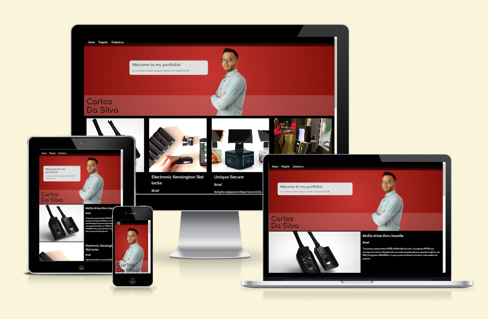

## UX - User Experience

### User stories

As a **Client** or **Employer**, I need to see some of Carlos' work to feel assured he has the skillset I'm looking for to contribute in my projects. Would also need an easy way to reach out to Carlos to discuss my project.

As a **Recruiter**, I need to see Carlos' employment history, ideally via LinkedIn or downloadble CV and be able to get in touch with him.

### Strategy

Build a simple and sophisticated looking website that showcases enough of my work in a seamless and intuitive format that encourages the visitor to reach out.

### Scope

I want to give the visitor, be a prospective Client/Employer or Recruiter a brief example of projects I've taken part of and my skillset. Leaving them wanting to explore my profiles and get in touch with me.

### Structure

Simply 3 sections in one single page:

  1) **Welcome/introduction**
    Welcoming the visitor with a friendly face and brief introduction to me.

  2) **Projects**
    A short description of projects I've undertaken with a photo of each.

  3) **Contact Us**
    A contact form and other platforms available for the visitor to choose from in how to reach out.

### Skeleton

<!-- Move mockups here -->

### Surface
#### Colour theme
For the minimalistic modern style, a monochromatic palette composed of virtually full Black and light greys with simply and dark red colour for an accent. This palette was used to create a comfortable viewing experience and draw more attention to the subject elements, namely my work and how to get hold of me.

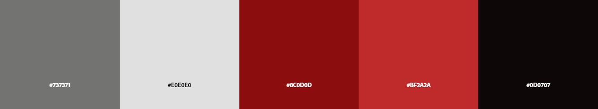

#### Typography

## Technologies
- Languages used:
  - [HTML5](https://en.wikipedia.org/wiki/HTML5)
  - [CSS3](https://en.wikipedia.org/wiki/CSS)
- [GitPod](https://www.gitpod.io/) - Cloud-based IDE to edit code and Git version control.
- [Github](https://github.com/) - to store and publish the project.
- [Google Fonts](https://fonts.google.com/) - to import fonts "Comfortaa" and "Dosis" into the website's CSS.
- [Font Awesome](https://fontawesome.com/) - to import icons for more recognizable action buttons. It has been used in:
  - The expandable Nav bar on narrow displays.
  - The X icon in expandable projects section.
  - The clear and submit form.
  - The contact platforms in the footer.
- [Am I Responsive](https://ui.dev/amiresponsive) - to visualise the website in various display sizes.
- [Adobe Color](https://color.adobe.com/create/color-wheel) - to generate the colour palette and Accessibility tools checking for contrast for legibility and color blind viewing.
- [Tiny PNG](https://tinypng.com/) - to compress images for faster page loading.
- [W3C HTML Validator](https://validator.w3.org/) - to validate the HTML code.
- [W3C CSS Validator](https://jigsaw.w3.org/css-validator/) - to validate the CSS code.

## Features 

### Existing Features

- __Navigation Bar__
  - The navigation bar sits across the the top of the page, it is fixed in position so no matter where the visitor has scrolled down to it is always available.
  - The links included **Home**, **Projects** and **Contact us** navigate to sections of the page, rather than to separate pages.
  - Aligned to the top left corner, on narrow displays it features as an expandable "burger" icon menu. 
  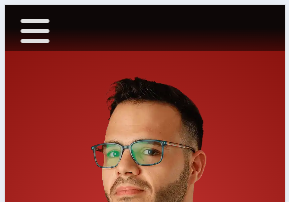 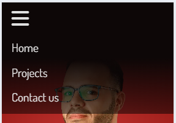
  - On wider displays, the navigation bar expands to display the links at all time. 
  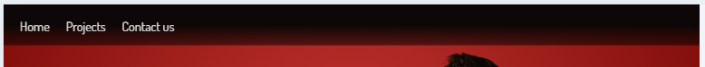
  - The virtually white text over the fading black background remains contrasting enough to be legible and giving the sophisticated touch to the site.

- __The landing page - Welcome__
  - The landing page consists of photograph of myself with my name as text overlay.
  - On mobile displays, the very next division below contains a message welcoming the visitor to my portfolio and stating my profession and location to help the visitor quickly indentify the sites intent. 
  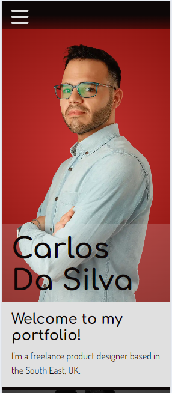
  - On displays wider than 600px, the division with the welcome message becomes a floating bubble next to my photo, so there is not too much redundant empty space in the welcome section. 
  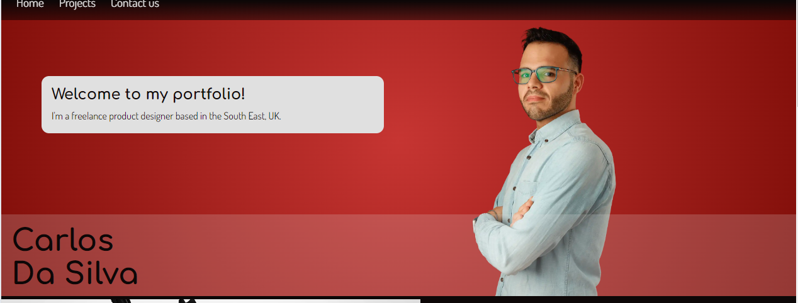

- __Projects Section__
  - This section contains a photo and brief given to 4 projects I have worked on, that compose the portfolio.
  - On mobile displays, each project is seen as a short wide section that displays the clipped image in the background with a smoked overlay and title in white text. This is to reduce the need to scroll through a lot of info on a small display before reaching the contact form and footer. Also, provides focus on the project being viewed. On tapping the particular project title, the section expands to expose the project image, the description of the project below and a closing icon on the top right corner. The visitor does not need to use the closing icon to expand the next project, they can tap the other project title to expand it and it will close the other. 
  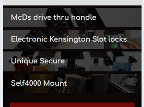  **>**  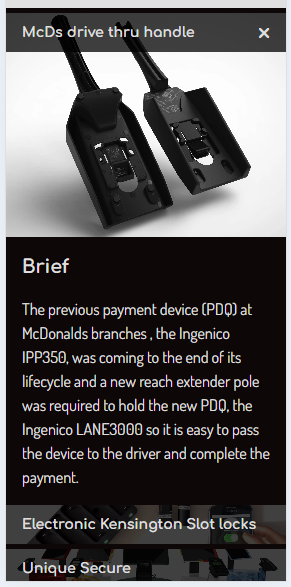
  - For displays 600px wide and greater, the projects are displayed as image to the left and text to the right, getting rid of the collapsible sections. On a display of that size the content is not too long to be able to scroll through easily. 
  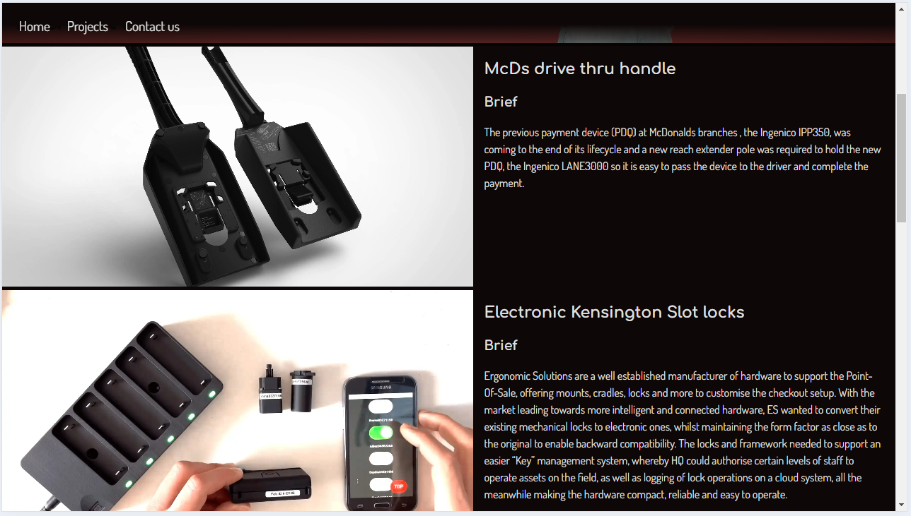
  - For displays 1500px wide and greater, the projects are displayed across the whole width of the view port, following a format of images in a row and description below. This makes use of the available space to maintain a comfortable reading experience of the website, as a whole viewport wide section per project would seem redundant for the content and harder to follow. 
  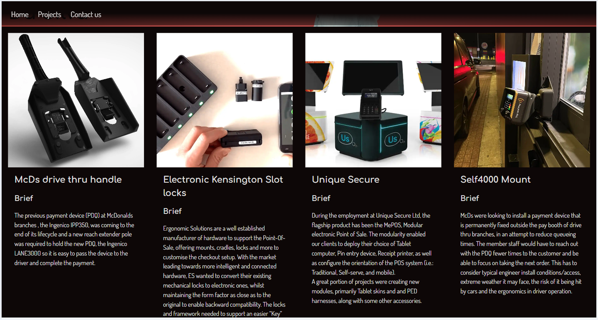 

- __Contact us form__
  - The contact form offers a means for the visitor to get in touch with myself directly from the website, prompting the visitor to introduce themselves and to describe what project they may be looking to collaborate on. 
  - The form collects First name, Surname, email address, phone number (not a required field) and body of text for a message.
  - It includes two buttons replaced with icons, reset form shown as an eraser icon, whilst the submit button is a paper airplane icon.
  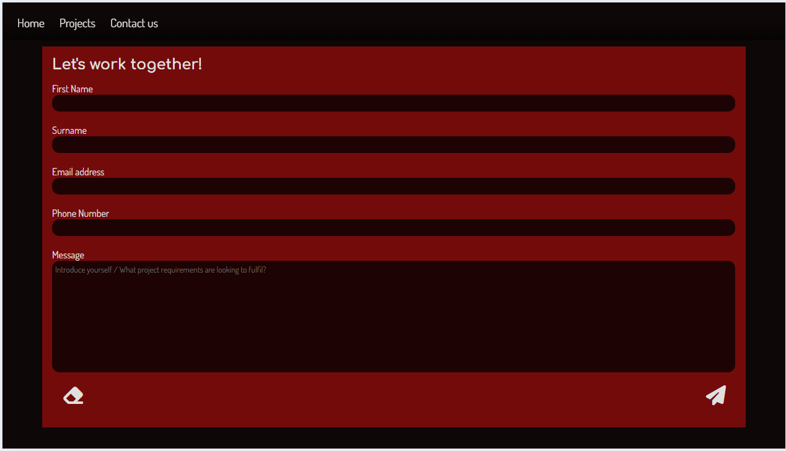

- __The Footer__ 
  - The footer contains links to my company's instagram page, my personal Linkedin profile, my company's whatsapp contact and etsy shop.
  - Should the visitor prefer to contact outside of the form, they are welcome to reach out via these means.
  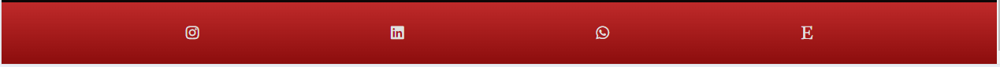

### Features Left to Implement
- Navigation hamburger icon to change to a cross when expanded to give a visual clue on how to close the menu.
- Make the navigation menu collapse on clicking a link that redirects to section on page.
- Create a projects page that includes a lot more detail on the projects described in the project section. When a visitor expands a project there could be a link for "More >>" which redirects to the section in the projects page that shows more information.
- A "thank you" message to replace the contact form when the form gets submitted successfully and that the form contents get forwarded to my email address to contact back.

## Testing 

<!-- In this section, you need to convince the assessor that you have conducted enough testing to legitimately believe that the site works well. Essentially, in this part you will want to go over all of your project’s features and ensure that they all work as intended, with the project providing an easy and straightforward way for the users to achieve their goals.

In addition, you should mention in this section how your project looks and works on different browsers and screen sizes.

You should also mention in this section any interesting bugs or problems you discovered during your testing, even if you haven't addressed them yet.

If this section grows too long, you may want to split it off into a separate file and link to it from here.
 -->

### Validator Testing 

- HTML
  - No errors were returned when passing through the official [W3C validator](https://validator.w3.org/nu/?doc=https%3A%2F%2Fdasic002.github.io%2FCarlos-Da-Silva-Folio%2Findex.html) 
  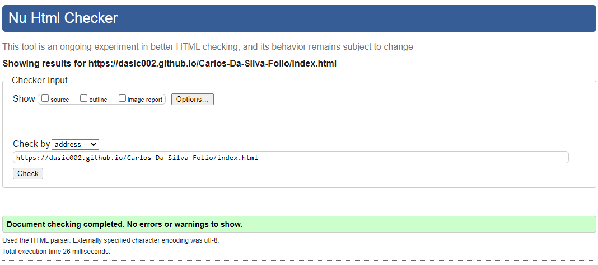
- CSS
  - No errors were found when passing through the official [(Jigsaw) validator](https://jigsaw.w3.org/css-validator/validator?uri=https%3A%2F%2Fdasic002.github.io%2FCarlos-Da-Silva-Folio%2Findex.html&profile=css3svg&usermedium=all&warning=1&vextwarning=&lang=en) 
  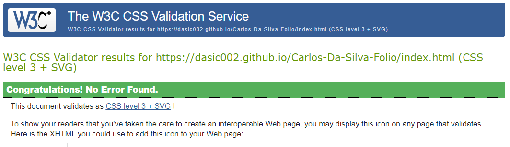 
- Accessibility
  - Running the site through lighthouse analysis confirms the colours and fonts used legible and accessible on either:
    - Mobile: 
  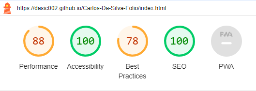
 
    - Desktop: 
  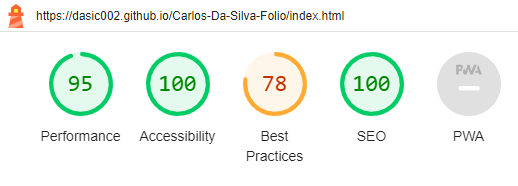

  - Running the site through [WAVE acessibility tool](https://wave.webaim.org/report#/https://dasic002.github.io/Carlos-Da-Silva-Folio/index.html) showed no obvious errors after some improvements were made. 
  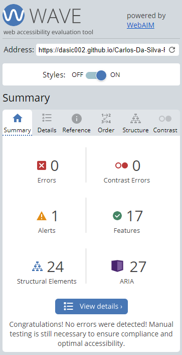

### Unfixed Bugs

- __Nav Bar - turning fully black on expanding__
The checkbox input to toggle open the menu works, but to create the appearance that the fade expands creating a solid black background across the very top does not seem to accept addressing the header to change its background-color to solid back. Need to remind myself how to add an object matching the size of the header that sits behind the hamburger icon.

- __Nav Bar - using section IDs on nav list__
Using Section IDs for the navigation of the site means the menu does not toggle off on clicking them. Tried using label element to trigger the checkbox that expands the nav menu:
  - wrapping the visible text of the anchor toggles the checkbox, but does not navigate;
  - wrapping the anchor, navigates but does toggle the checkbox.
Might be able to improve UI by substituting the hamburger/bars icon on expading the menu with a X icon.

- __Google fonts - Comfortaa not loading__
The imported font Comfortaa does not seem to have loaded correctly.

<!-- You will need to mention unfixed bugs and why they were not fixed. This section should include shortcomings of the frameworks or technologies used. Although time can be a big variable to consider, paucity of time and difficulty understanding implementation is not a valid reason to leave bugs unfixed.  -->

## Deployment

<!-- This section should describe the process you went through to deploy the project to a hosting platform (e.g. GitHub) 

- The site was deployed to GitHub pages. The steps to deploy are as follows: 
  - In the GitHub repository, navigate to the Settings tab 
  - From the source section drop-down menu, select the Master Branch
  - Once the master branch has been selected, the page will be automatically refreshed with a detailed ribbon display to indicate the successful deployment. 

The live link can be found here - https://code-institute-org.github.io/love-running-2.0/index.html -->

## Credits 

<!-- In this section you need to reference where you got your content, media and extra help from. It is common practice to use code from other repositories and tutorials, however, it is important to be very specific about these sources to avoid plagiarism.  -->

<!-- You can break the credits section up into Content and Media, depending on what you have included in your project.  -->

### Content 

- Icons used in the footer and nav bar were sourced from [Font Awesome](https://fontawesome.com/)
<!-- - The text for the Home page was taken from Wikipedia Article A
- Instructions on how to implement form validation on the Sign Up page was taken from [Specific YouTube Tutorial](https://www.youtube.com/)
- The icons in the footer were taken from [Font Awesome](https://fontawesome.com/) -->

### Media
<!-- 
- The photos used on the home and sign up page are from This Open Source site
- The images used for the gallery page were taken from this other open source site

Congratulations on completing your Readme, you have made another big stride in the direction of being a developer!  -->

### Code
- CSS and HTML code for the nav bar in the header was originally taken from the [Love Running walkthrough project](https://github.com/dasic002/Love-Running), then CSS was altered for the intended look.
- CSS and HTML code for the function of expanding and collapsing of project snippets sourced from [Web mdn docs references for the pseudo :checked](https://developer.mozilla.org/en-US/docs/Web/CSS/:checked).

### Acknoledgement

## Other General Project Advice

<!-- Below you will find a couple of extra tips that may be helpful when completing your project. Remember that each of these projects will become part of your final portfolio so it’s important to allow enough time to showcase your best work! 

- One of the most basic elements of keeping a healthy commit history is with the commit message. When getting started with your project, read through [this article](https://chris.beams.io/posts/git-commit/) by Chris Beams on How to Write  a Git Commit Message 
  - Make sure to keep the messages in the imperative mood 

- When naming the files in your project directory, make sure to consider meaningful naming of files, point to specific names and sections of content.
  - For example, instead of naming an image used ‘image1.png’ consider naming it ‘landing_page_img.png’. This will ensure that there are clear file paths kept. 

- Do some extra research on good and bad coding practices, there are a handful of useful articles to read, consider reviewing the following list when getting started:
  - [Writing Your Best Code](https://learn.shayhowe.com/html-css/writing-your-best-code/)
  - [HTML & CSS Coding Best Practices](https://medium.com/@inceptiondj.info/html-css-coding-best-practice-fadb9870a00f)
  - [Google HTML/CSS Style Guide](https://google.github.io/styleguide/htmlcssguide.html#General)

Getting started with your Portfolio Projects can be daunting, planning your project can make it a lot easier to tackle, take small steps to reach the final outcome and enjoy the process!  -->