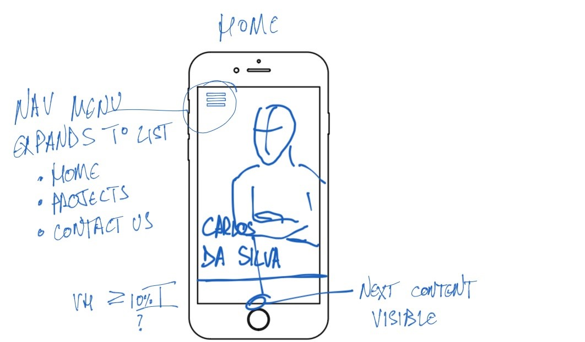
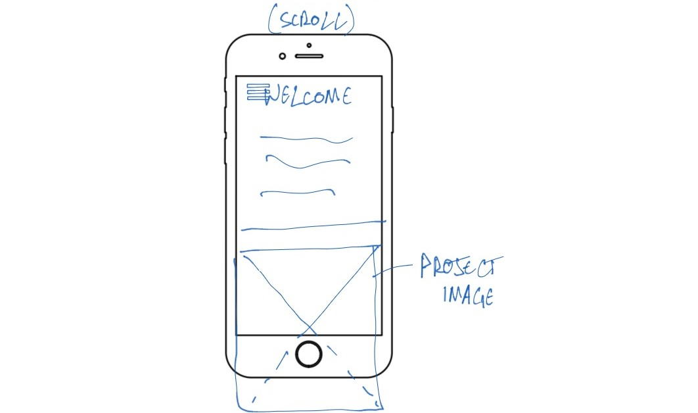
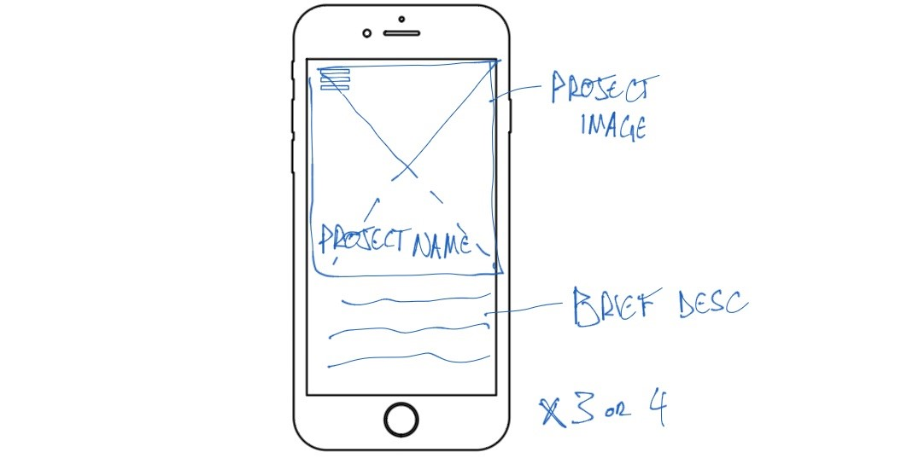
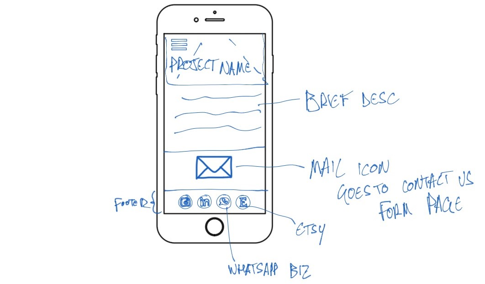
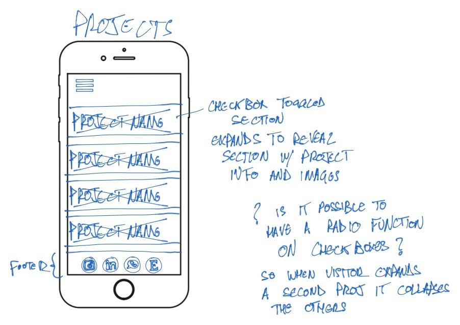
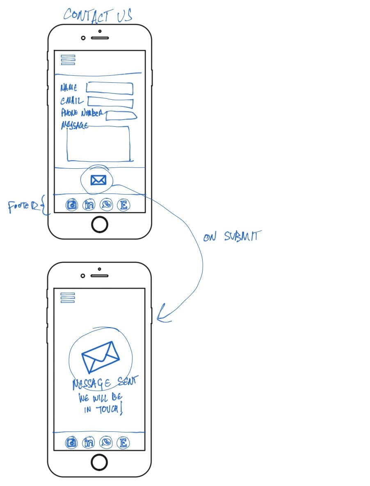

# Carlos Da Silva Folio

**Carlos Da Silva Folio** is a portfolio site for myself. It will showcase some of my work as a Product Design Engineer/Industrial Designer to prospective clients and/or employers. Visitors will be able to learn a little about my background, see examples of my work, find my contact details and visit my linkedIn profile, company's instagram and etsy store.

The business goals of this website are:
- Build brand awareness
- Intrigue visitors with the projects undertaken and make them want to look into the challenges overcome
- Bring in revenue through increased contact from prospective clients looking to collaborate

[View the deployed website here](https://dasic002.github.io/Carlos-Da-Silva-Folio/index.html)

## UX - User Experience

### User stories

As a **Client** or **Employer**, I need to see some of Carlos' work to feel assured he has the skillset I'm looking for to contribute in my projects. Would also need an easy way to reach out to Carlos to discuss my project.

As a **Recruiter**, I need to see Carlos' employment history, ideally via LinkedIn or downloadble CV and be able to get in touch with him.

### Strategy

Build a simple and sophisticated looking website that showcases enough of my work in a seamless and intuitive format that encourages the visitor to reach out.

### Scope

I want to give the visitor, be a prospective Client/Employer or Recruiter a brief example of projects I've taken part of and my skillset. Leaving them wanting to explore my profiles and get in touch with me.

### Structure

Simply 3 sections in one single page:

  1) **Welcome/introduction**
    Welcoming the visitor with a friendly face and brief introduction to me.

  2) **Projects**
    A short description of projects I've undertaken with a photo of each.

  3) **Contact Us**
    A contact form and other platforms available for the visitor to choose from in how to reach out.

### Skeleton

<!-- Move mockups here -->

### Surface
#### Colour theme
For the minimalistic modern style, a monochromatic palette composed of virtually full Black and light greys with simply and dark red colour for an accent. This palette was used to create a comfortable viewing experience and draw more attention to the subject elements, namely my work and how to get hold of me.

#### Typography

## Technologies
- Languages used:
  - [HTML5](https://en.wikipedia.org/wiki/HTML5)
  - [CSS3](https://en.wikipedia.org/wiki/CSS)
- [GitPod](https://www.gitpod.io/) - Cloud-based IDE to edit code and Git version control.
- [Github](https://github.com/) - to store and publish the project.
- [Google Fonts](https://fonts.google.com/) - to import fonts "Comfortaa" and "Dosis" into the website's CSS.
- [Font Awesome](https://fontawesome.com/) - to import icons for more recognizable action buttons. It has been used in:
  - The expandable Nav bar on narrow displays.
  - The X icon in expandable projects section.
  - The clear and submit form.
  - The contact platforms in the footer.
- [Am I Responsive](https://ui.dev/amiresponsive) - to visualise the website in various display sizes.
- [Adobe Color](https://color.adobe.com/create/color-wheel) - to generate the colour palette and Accessibility tools checking for contrast for legibility and color blind viewing.
- [Tiny PNG](https://tinypng.com/) - to compress images for faster page loading.
- [W3C HTML Validator](https://validator.w3.org/) - to validate the HTML code.
- [W3C CSS Validator](https://jigsaw.w3.org/css-validator/) - to validate the CSS code.

## Features 

### Existing Features

- __Navigation Bar__
  - The navigation bar sits across the the top of the page, it is fixed in position so no matter where the visitor has scrolled down to it is always available.
  - The links included **Home**, **Projects** and **Contact us** navigate to sections of the page, rather than to separate pages.
  - Aligned to the top left corner, on narrow displays it features as an expandable "burger" icon menu. 
   
  - On wider displays, the navigation bar expands to display the links at all time. 
  
  - The virtually white text over the fading black background remains contrasting enough to be legible and giving the sophisticated touch to the site.

- __The landing page - Welcome__
  - The landing page consists of photograph of myself with my name as text overlay.
  - On mobile displays, the very next division below contains a message welcoming the visitor to my portfolio and stating my profession and location to help the visitor quickly indentify the sites intent. 
  
  - On displays wider than 600px, the division with the welcome message becomes a floating bubble next to my photo, so there is not too much redundant empty space in the welcome section. 
  

- __Projects Section__

- __Contact us form__

- __The Footer__ 
<!-- 
  - The footer section includes links to the relevant social media sites for Love Running. The links will open to a new tab to allow easy navigation for the user. 
  - The footer is valuable to the user as it encourages them to keep connected via social media

 -->

### Features Left to Implement

- __Landing page__

The landing will bring up a photo of Carlos with name and a nav bar at the top.
  - __Nav bar__
    - On mobile screens
      - This menu will appear as discreet hamburger icon on the top left corner, overlaying the content at all time.
    - On tablets and larger
      - The links will be visible along the top edge.
  - __Welcome image__
    - On mobile screens
      - Simply a photo of Carlos with name on the bottom left corner of the photo.
      - The photo will be shorter than the device view so that the next section is just visible and intuitively prompt the visitor to scroll.
    - On tablets and larger
      - The photo will align to the right, making room for the welcome section to fit on the left.

- __Welcome section__

  A section containing a short message welcoming visitors to the website.

  - On mobile screens
    - As the visitor scrolls down to view this section.
    - This section will be short enough to make the first project snippet visible and encourage scrolling.
  - On tablets and larger
    - This section will share the width of the screen with the welcome image, it will sit to the left of the image.

- __Project snippet section__

A section with 3 or 4 divs containing a project hero image, project name and a short description of the project. The intent is to make these clickable to take the visitor over to the projects page with the given project in view.

  - On mobile screens
    - The divisions will be composed of hero image first and followed by project name and description, visible as the visitor scrolls through.
  - On tablets
    - The image and description will stand side by side to take up the whole width.
    - likely alternating the side the image sits on.
  - On laptops or larger
    - The divisions will display 2 project snippets across the display width.

- __Contact section__

   - __Contact us__
   At the bottom of the page, the last section before the footer will invite the visitor to reach out. This section will be clickable to redirect the visitor to the Contact Us page. This present itself as a mail icon centered in all screens, possibly only subtelly increasing in size when viewed in larger displays.

   - __Footer__
   The footer will be visible on all pages and include clickable icons that redirect the visitor to our:
    - Business Instagram profile
    - Personal LinkedIn profile
    - Whatapp Business contact
    - Business Etsy profile

- __Projects page__

  - __Nav bar__
    - visible as in the landing page

  - __Project section__
    Currently, unsure on how much information to put per project, so unsure on the space we will need. Thinking mobile first, it certainly will be too much to display at once, so looking to create sections that expand.
    
    - On mobile screens and tablets
      - full width divisions, in column formation containing the hero image with a transparent black background over the top, so the project name is legible.
      - as the visitor clicks the section, it expands to reveal the project information.
      - an "X" will be present to give the option to close the section.
      - Unsure if possible at this moment, but the ideal would be that only one project information is visible at a given time. So should another project section be opened, all others are closed, but also that when the close "X" is clicked, all projects are closed. I suspect the easiest way to implement this is creating an invisible checkbox that when checked to open, it makes the value of the others unchecked. And unchecking it via the "X" icon only closes the relevant section.
    - On Laptops and larger
      - These divisions will stand 4 projects side by side across the width of the display.
      - When clicked on, the information expands below them.
  
  - __Contact section__
    A repeat of what is included on the landing/Home page.

- __Contact us page__

  - __Nav bar__
    Remains the same for consistency

  - __Form__
    The form on the contact page will include fields for the following:
    - Name - required
    - Email - required
    - Phone number
    - Message - required
    - Clear form - reset button
    - Send - submit button

    How will it look:
    - On mobile screens
      - taking up the full width with fields in a column formation.
    - On tablets and larger
      - Name/Email/Phone number fields may be placed in one line, whilst the text area box for the message expands.

    On submission of the form, we need to provide validation of data being sent, is it possible to use CI's formdump to feedback information captured correctly in an iframe?
    That could be laid out as our page having the mail icon, with a message thanking the visitor for reaching out and someone will be in touch soon, and below that we can see the iframe with the formdump to provide that validation.

  - __Footer__
    Remains the same for consistency 

## Testing 

<!-- In this section, you need to convince the assessor that you have conducted enough testing to legitimately believe that the site works well. Essentially, in this part you will want to go over all of your project’s features and ensure that they all work as intended, with the project providing an easy and straightforward way for the users to achieve their goals.

In addition, you should mention in this section how your project looks and works on different browsers and screen sizes.

You should also mention in this section any interesting bugs or problems you discovered during your testing, even if you haven't addressed them yet.

If this section grows too long, you may want to split it off into a separate file and link to it from here.
 -->

### Validator Testing 

- HTML
  - No errors were returned when passing through the official [W3C validator](https://validator.w3.org/nu/?doc=https%3A%2F%2Fdasic002.github.io%2FCarlos-Da-Silva-Folio%2Findex.html) 
  
- CSS
  - No errors were found when passing through the official [(Jigsaw) validator](https://jigsaw.w3.org/css-validator/validator?uri=https%3A%2F%2Fdasic002.github.io%2FCarlos-Da-Silva-Folio%2Findex.html&profile=css3svg&usermedium=all&warning=1&vextwarning=&lang=en) 
   
- Accessibility
  - Running the site through lighthouse analysis confirms the colours and fonts used legible and accessible on either:
    - Mobile: 
  
 
    - Desktop: 
  

  - Running the site through [WAVE acessibility tool](https://wave.webaim.org/report#/https://dasic002.github.io/Carlos-Da-Silva-Folio/index.html) showed no obvious errors after some improvements were made. 
  

### Unfixed Bugs

- __Nav Bar - turning fully black on expanding__
The checkbox input to toggle open the menu works, but to create the appearance that the fade expands creating a solid black background across the very top does not seem to accept addressing the header to change its background-color to solid back. Need to remind myself how to add an object matching the size of the header that sits behind the hamburger icon.

- __Nav Bar - using section IDs on nav list__
Using Section IDs for the navigation of the site means the menu does not toggle off on clicking them. Tried using label element to trigger the checkbox that expands the nav menu:
  - wrapping the visible text of the anchor toggles the checkbox, but does not navigate;
  - wrapping the anchor, navigates but does toggle the checkbox.
Might be able to improve UI by substituting the hamburger/bars icon on expading the menu with a X icon.

- __Google fonts - Comfortaa not loading__
The imported font Comfortaa does not seem to have loaded correctly.

<!-- You will need to mention unfixed bugs and why they were not fixed. This section should include shortcomings of the frameworks or technologies used. Although time can be a big variable to consider, paucity of time and difficulty understanding implementation is not a valid reason to leave bugs unfixed.  -->

## Deployment

<!-- This section should describe the process you went through to deploy the project to a hosting platform (e.g. GitHub) 

- The site was deployed to GitHub pages. The steps to deploy are as follows: 
  - In the GitHub repository, navigate to the Settings tab 
  - From the source section drop-down menu, select the Master Branch
  - Once the master branch has been selected, the page will be automatically refreshed with a detailed ribbon display to indicate the successful deployment. 

The live link can be found here - https://code-institute-org.github.io/love-running-2.0/index.html -->

## Credits 

<!-- In this section you need to reference where you got your content, media and extra help from. It is common practice to use code from other repositories and tutorials, however, it is important to be very specific about these sources to avoid plagiarism.  -->

<!-- You can break the credits section up into Content and Media, depending on what you have included in your project.  -->

### Content 

- Icons used in the footer and nav bar were sourced from [Font Awesome](https://fontawesome.com/)
<!-- - The text for the Home page was taken from Wikipedia Article A
- Instructions on how to implement form validation on the Sign Up page was taken from [Specific YouTube Tutorial](https://www.youtube.com/)
- The icons in the footer were taken from [Font Awesome](https://fontawesome.com/) -->

### Media
<!-- 
- The photos used on the home and sign up page are from This Open Source site
- The images used for the gallery page were taken from this other open source site

Congratulations on completing your Readme, you have made another big stride in the direction of being a developer!  -->

### Code
- CSS and HTML code for the nav bar in the header was originally taken from the [Love Running walkthrough project](https://github.com/dasic002/Love-Running), then CSS was altered for the intended look.
- CSS and HTML code for the function of expanding and collapsing of project snippets sourced from [Web mdn docs references for the pseudo :checked](https://developer.mozilla.org/en-US/docs/Web/CSS/:checked).

### Acknoledgement

## Other General Project Advice

<!-- Below you will find a couple of extra tips that may be helpful when completing your project. Remember that each of these projects will become part of your final portfolio so it’s important to allow enough time to showcase your best work! 

- One of the most basic elements of keeping a healthy commit history is with the commit message. When getting started with your project, read through [this article](https://chris.beams.io/posts/git-commit/) by Chris Beams on How to Write  a Git Commit Message 
  - Make sure to keep the messages in the imperative mood 

- When naming the files in your project directory, make sure to consider meaningful naming of files, point to specific names and sections of content.
  - For example, instead of naming an image used ‘image1.png’ consider naming it ‘landing_page_img.png’. This will ensure that there are clear file paths kept. 

- Do some extra research on good and bad coding practices, there are a handful of useful articles to read, consider reviewing the following list when getting started:
  - [Writing Your Best Code](https://learn.shayhowe.com/html-css/writing-your-best-code/)
  - [HTML & CSS Coding Best Practices](https://medium.com/@inceptiondj.info/html-css-coding-best-practice-fadb9870a00f)
  - [Google HTML/CSS Style Guide](https://google.github.io/styleguide/htmlcssguide.html#General)

Getting started with your Portfolio Projects can be daunting, planning your project can make it a lot easier to tackle, take small steps to reach the final outcome and enjoy the process!  -->